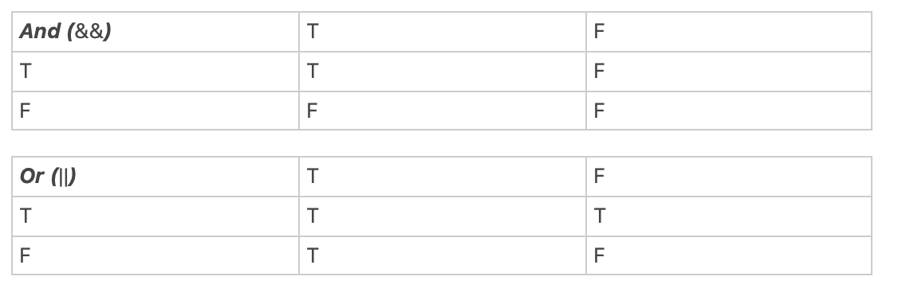

`mv` in terminal -- rename a file
`node filename.js` enter, then node will run this file.
command + D can select more variables with the same name
we cannot do `console.log(name[-2])`; we can only do like :`console.log(name.[name.length- 2])`
arrary, object shold always use `const`

snake case, camel case, shortcut: command + shift + p to searching bash, then search "case".

always use === to make strict equal

no var, always use const/let

NAND, XOR
